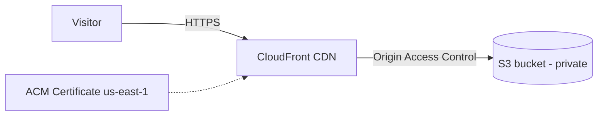

# Week 1 — Static Portfolio Site on S3 + CloudFront

## What it does

Personal portfolio site served globally over HTTPS with zero servers. S3 stores the files (private bucket), CloudFront serves them via CDN, ACM provides the TLS certificate.

## Architecture



## Key decisions

- **Origin Access Control (OAC), not a public bucket.** The bucket blocks all public access; only the CloudFront distribution can read objects. Public S3 websites are the #1 misconfiguration in the wild — this shows I know the secure pattern.
- **ACM cert in us-east-1.** CloudFront only accepts certificates from us-east-1, regardless of where the bucket lives. Classic interview trivia, learned by doing.
- **`PriceClass_100`** (NA + Europe edges only) keeps cost near zero for a portfolio site.
- **Files uploaded by Terraform** with explicit content types — otherwise S3 serves HTML as `application/octet-stream` and browsers download instead of render.

## How to run

```bash
cd terraform
terraform init
terraform apply          # ~5 min (CloudFront is slow to provision)
terraform output cloudfront_url
```

With a custom domain: `terraform apply -var domain_name=example.com`, then create the DNS validation record ACM asks for.

Tear down: `terraform destroy`

## What I'd improve

- Route 53 hosted zone + automatic DNS validation for the cert.
- CloudFront function to rewrite `/about` → `/about/index.html` for clean URLs.
- GitHub Actions job that syncs the site and invalidates the CloudFront cache on push.
