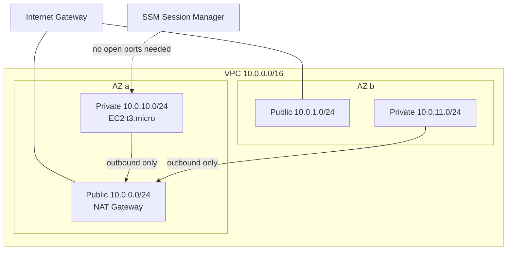

# Week 2 — VPC Networking Lab

## What it does

Builds a production-shaped network from scratch: a VPC with 2 public and 2 private subnets across two availability zones, an internet gateway, a NAT gateway, and a private EC2 instance that has **no inbound access at all** — you connect through SSM Session Manager.

## Architecture



## Key decisions

- **SSM Session Manager instead of a bastion host.** The instance's security group has zero inbound rules — the SSM agent makes an *outbound* HTTPS connection to AWS, and sessions ride that channel. No SSH keys to leak, no port 22 exposed, every session logged in CloudTrail.
- **Single NAT gateway.** Production would use one per AZ (~$32/month each); for a lab, one is enough and I can articulate the trade-off: if AZ-a dies, private instances in AZ-b lose internet egress.
- **`cidrsubnet()` for addressing.** Subnets are computed from the VPC CIDR, not hardcoded — change `vpc_cidr` once and everything reflows.
- **DNS support + hostnames enabled** — required for SSM endpoints to resolve from private subnets.

## How to verify it works

```bash
terraform init && terraform apply    # ~3 min (NAT gateway is the slow part)

# Connect to the private instance with no SSH, no keys, no open ports:
aws ssm start-session --target $(terraform output -raw private_instance_id)

# Inside the session — prove NAT egress works:
curl -s https://checkip.amazonaws.com   # returns the NAT gateway's EIP

# Prove there is no inbound path: the instance has no public IP
# and its security group has zero ingress rules.
```

Tear down: `terraform destroy` (do this — the NAT gateway bills hourly).

## What I'd improve

- VPC endpoints for SSM/EC2Messages/SSMMessages so the instance needs no internet at all.
- Flow logs to CloudWatch for traffic visibility.
- Turn this into a reusable Terraform module consumed by Week 3.
