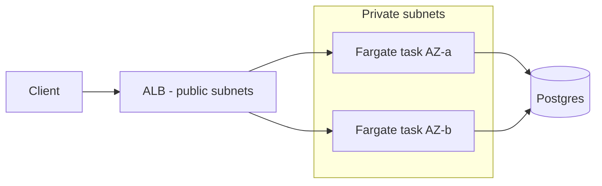

# Week 3 — URL Shortener on ECS Fargate

## What it does

A Node.js/Express URL shortener backed by Postgres. Runs locally with `docker compose`; deploys to ECS Fargate behind an Application Load Balancer, inside the [Week 2 VPC](../week2-vpc-lab).

**API:**
| Method | Path | Description |
|--------|------|-------------|
| POST | `/links` `{"url": "https://..."}` | Create a short link |
| GET | `/:code` | Redirect (counts hits) |
| GET | `/links/:code/stats` | Hit count + metadata |
| GET | `/health` | ALB health check |

## Architecture



## Key decisions

- **Tasks in private subnets, `target_type = "ip"`.** Fargate tasks have no public IPs; only the ALB's security group can reach port 3000. Image pulls go out via the Week 2 NAT gateway.
- **Multi-stage Dockerfile, non-root user, healthcheck.** Final image is ~130 MB and runs as `node`, not root — the two things image scanners flag first.
- **2 tasks across 2 AZs** — the ALB health-checks `/health` and replaces unhealthy tasks; killing one task manually is a nice demo of self-healing.
- **`desired_count` and image tag as variables** so the CI pipeline can roll a new tag without editing HCL.

## Run locally

```bash
docker compose up --build
curl -X POST localhost:3000/links -H 'content-type: application/json' -d '{"url":"https://aws.amazon.com"}'
curl -i localhost:3000/<code>          # 302 redirect
```

Tests (no DB needed): `cd api && npm test`

## Deploy

```bash
# 1. Build + push the image
aws ecr get-login-password | docker login --username AWS --password-stdin <account>.dkr.ecr.us-east-1.amazonaws.com
docker build -t shortener-api ./api
docker tag shortener-api:latest <ecr-url>:latest
docker push <ecr-url>:latest

# 2. Deploy on top of the Week 2 VPC
cd terraform
terraform apply \
  -var vpc_id=$(cd ../../week2-vpc-lab/terraform && terraform output -raw vpc_id) \
  -var 'public_subnet_ids=[...]' -var 'private_subnet_ids=[...]' \
  -var database_url=postgres://...
```

## What I'd improve

- RDS Postgres in the private subnets (currently expects an external/Neon DB to stay in free tier).
- HTTPS listener with an ACM cert.
- Autoscaling policy on CPU + request count.
